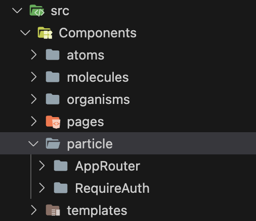
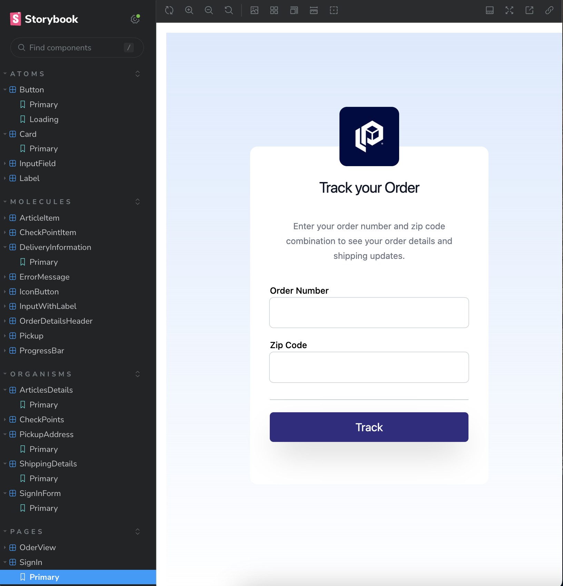
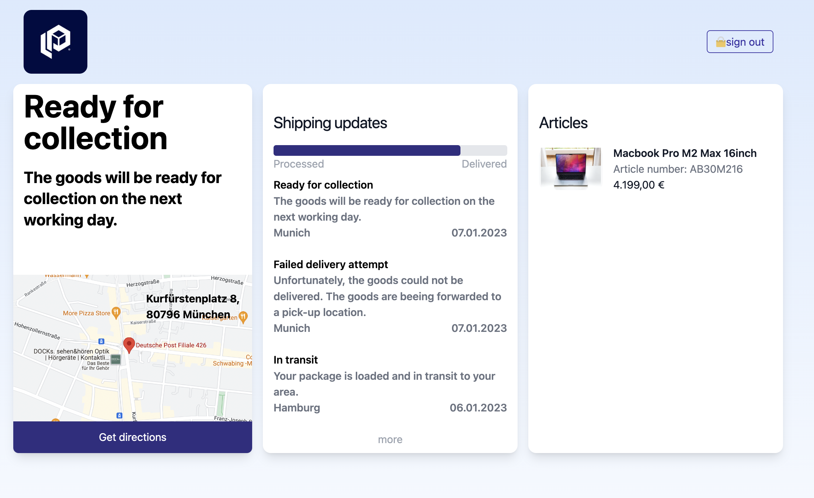

# Parcel Lab frontend challenge

This project is provided as a sample solution for parcel lab frontend challenge. Base on Atomic design to build the UI component using storybook, in addition to axios and SWR for handling requests and caching, and Tailwind for styling the application.

## Atomic Design

As in the structure of Components folder in the project you can see it's divided into subfolder which represents a set responsible components, either seatless component or has effect to the application. there is also anther folder `particle` folder which added to handle none UI Component, but it's not part of the Atomic Design.

## Storybook

### `npm run storybook`

The application implemented by storybook for UI styling and testing, and check how the component integrated together from the UI and styling perspective. this also grouped as atomic design for better experience for developer.

This helps to move and check the project components and test its behavior and usability.

## Testing

### `npm test`

There are three different level of testing in the solution, which cover the common and advance seniors in daily basis, as the following:

### Unit Testing:

There is a sample for unit testing in the following project path `/src/shared/util/orderUtil.spec.ts`

### Integration Testing:

There is a sample for integration testing as the following:

1. Context: `/src/context/OrderDetailsContext.spec.tsx`
2. Component: `/src/components/organisms/SignInForm/SignInForm.spec.tsx`

# Order View

